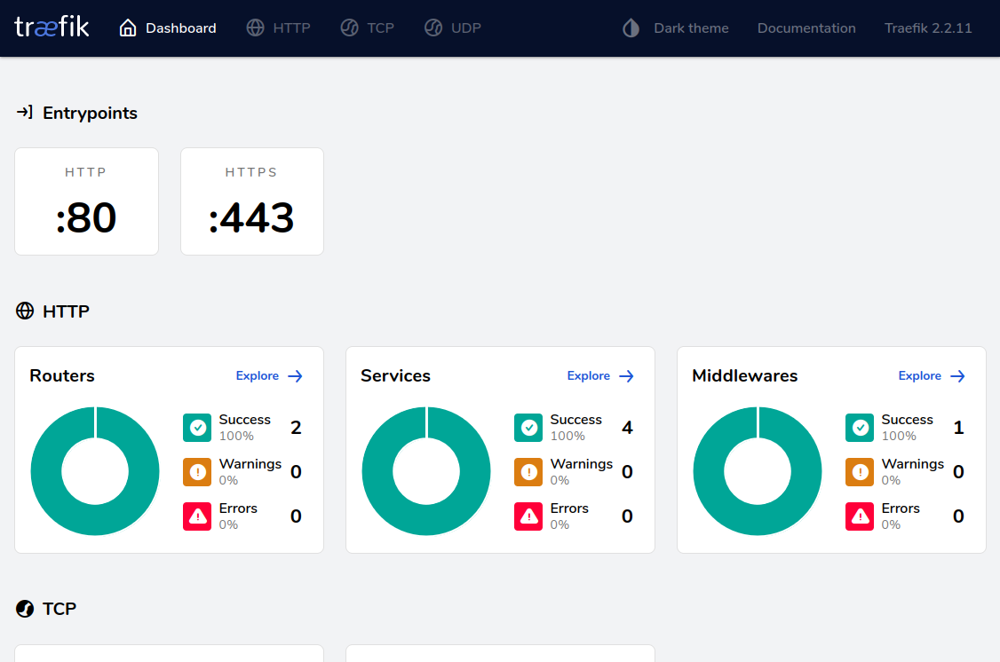
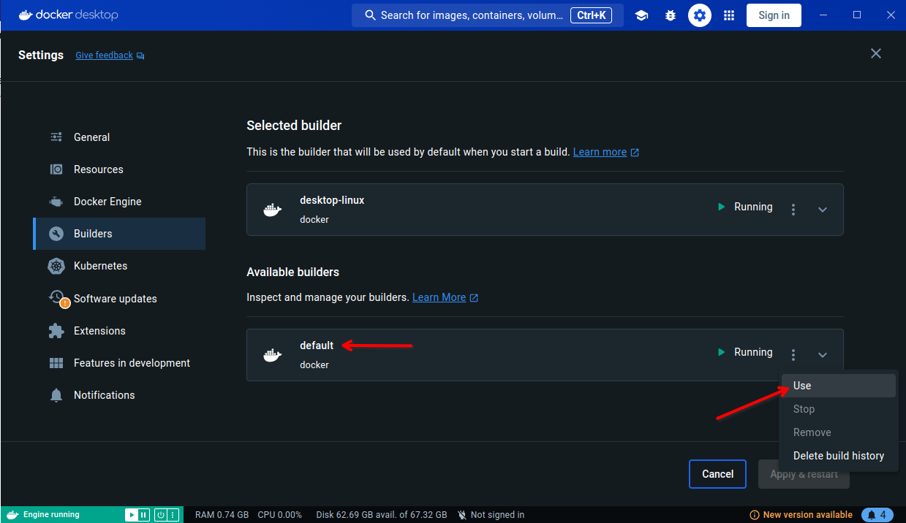

# Traefik reverse proxy
A Traefik Docker configuration that acts as the entrypoint for my localhost environment.


## Setup
First we will need to make the `traefik-reverse-proxy` Docker network.
You can do this with the following command:
```
docker network create traefik-reverse-proxy
```

Once you created the Docker network, you can start the Traefik container with the following command:
```
docker-compose up -d
```


## Traefik dashboard
If you want to see which containers are using Traefik at the moment, you can visit the Traefik dashboard.

You can visit the Traefik dashboard at [https://traefik.localhost](https://traefik.localhost).




## Troubleshooting
You may run into issues while setting up this container, the more common issues have been documented here.

### Network not found
If you attempt to start the container and get an error like this:
```
Error response from daemon: network traefik-reverse-proxy not found
```

Then you most likely forgot to create the `traefik-reverse-proxy` Docker network before starting the container for the first time.
Check if you executed all the steps in the setup section and then try again.


### Ports are not available (Permission denied)
If you are using Docker Desktop and you get an error like this:
```
Error response from daemon: Ports are not available: exposing port TCP 127.0.0.1:443 -> 0.0.0.0:0: listen tcp 127.0.0.1:443: bind: permission denied
```

Then make sure that you use the Docker engine of the host machine and not the build in one from Docker Desktop.
This is because ports below 1024 are considered "privileged" on Linux and require higher permissions that the Docker Desktop engine doesn't have.

Using the system/default Docker engine should resolve the issue.


