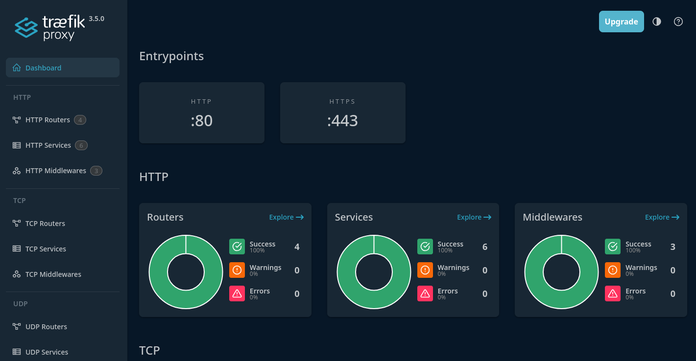

# Traefik reverse proxy
A Traefik Docker configuration that acts as the entrypoint for my development environment.


## Setup
The setup process is pretty simple, we will only have to execute a couple of steps to get it up and running.

### Create the Docker network
First we will need to make the `traefik-reverse-proxy` Docker network.
You can do this with the following command:
```
docker network create traefik-reverse-proxy
```

### Generate a TLS certificate
We will generate a certificate in order to allow HTTPS requests on our development environment.
The certificate will be a wildcard certificate, this is done so that all your development applications can use this certificate.

Depending on your preference, you can select between `localhost`, `dev` and `test` as the top level domain.
```
cd tls

# If you want to use .localhost, run
./generate_wildcard_localhost_certificate.sh

# If you want to use .dev, run
# ./generate_wildcard_dev_certificate.sh

# If you want to use .test, run
# ./generate_wildcard_test_certificate.sh
```

> [!IMPORTANT]  
> We assume that you use the ".localhost" top level domain in this container.
>
> If you use something else, you will also have to update the router rule inside the `docker-compose.yml` file of this repository and all the project that you are hosting.


### Start the container
Once you have done all of that, you are ready to get started!

Simply run the following command to start the Traefik container:
```
docker-compose up -d
```


## Traefik dashboard
If you want to see which containers are using Traefik at the moment, you can visit the Traefik dashboard.

You can visit the Traefik dashboard at [https://traefik.localhost](https://traefik.localhost).




## Forward non-Docker requests to upstream server
If the container is unable to find any Docker containers that matches the incoming request, it will forward the HTTP request to the host machine on port `81`.

This allows you to for example use an Apache website running on the host machine as well as Docker applications on the same server on the same port.

Traefik will automatically upgrade the request of the user to HTTPS using the `traefik_wildcard` certificate and key stored in the `tls` directory. You generated these certificates during the setup process of this container.


## Troubleshooting
You may run into issues while setting up this container, the more common issues have been documented here.

### Network not found
If you attempt to start the container and get an error like this:
```
Error response from daemon: network traefik-reverse-proxy not found
```

Then you most likely forgot to create the `traefik-reverse-proxy` Docker network before starting the container for the first time.
Check if you executed all the steps in the setup section and then try again.


### Ports are not available (Permission denied)
If you are using Docker Desktop and you get an error like this:
```
Error response from daemon: Ports are not available: exposing port TCP 127.0.0.1:443 -> 0.0.0.0:0: listen tcp 127.0.0.1:443: bind: permission denied
```

Then make sure that you use the Docker engine of the host machine and not the build in one from Docker Desktop.
This is because ports below 1024 are considered "privileged" on Linux and require higher permissions that the Docker Desktop engine doesn't have.

Using the system/default Docker engine should resolve the issue.


